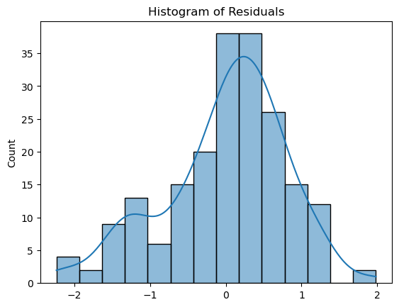
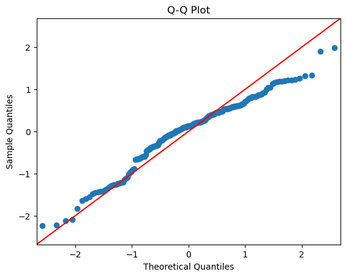

---

# Remote-CO2-Emissions189

---

Jun Hwang,

Isaiah Jones,

Nathan Ko

---

## Abstract

This study explores the relationship between the brief transition to remote work in 2020 and $\mathrm{CO_2}$ consumptions within the U.S. with the goal.... Utilizing a dataset from  U.S. Energy Information Administration, we embark on a comprehensive analysis using a variety of statistical methods including linear regression and hypothesis testing, to uncover....  Through linear regression, we aim to explore the probabilistic and statistical relationship. This research evaluates the environmental impact of increased remote work by comparing carbon footprints before, during, and after the pandemic, focusing on how shifts in remote work affect carbon emissions, urban planning, and infrastructure development. It provides valuable insights for governments, companies, and communities to adapt policies and projects that support sustainability goals and accommodate future commuting trends

## 1 Introduction

By evaluating the environmental impact of increased remote work by comparing carbon footprints before the pandemic, during the pandemic, and after the pandemic. Comparing carbon footprints to evaluate the environmental impact before, during, and after the pandemic is important for many reasons. Understanding how remote work affects carbon emissions can help governments make rules, helping meet goals to reduce pollution. Insights from this analysis can help many companies that are committed to sustainability goals to understand how shifting work patterns may contribute to the goals. 
This research can also give an intricate analysis of the environmental change due to increased remote works, in which urban planners and infrastructure developers can adjust their projects to accommodate a future with potentially less commuting, which may reshape public transportation schedules, reducing road expansions, or repurposing office space areas into residential or green spaces. Moreover, communities can better prepare for any future disruptions, whether they’re due to health issues, environmental concerns, or technology changes. In this study, we will… 

## 2 Demographic and Behavioral Data
	
### 2.1 Data Source
Our data comes from the U.S. Energy Information Administration and... It comprises CO2 emissions data for all fifty states from 1970 to 2021. With other columns

	
### 2.2 Exploratory Data Analysis

	
**Figure 1: Lineplot**

**Figure 2: Lineplot**

**Figure 3: Correleation Scatter plot**
	

## 3 Regression model
	
### 3.1 Linear Regression

### 3.1.1 Assumptions and Model Diagnostics

	

**Figure 4: Residual Plot**
		

	

**Figure 5: QQplot**
		

### 3.1.2 Preprocessing, Modeling and Prediction
	

	
### 3.2 Hypothesis Testing
	

	
**Figure 8: Confusion matrix**

	
## 4  Conclusion and Future Works
	

References

[1] Kapturov, Alexander. (2024). Sleep Patterns. Kaggle.
      https://www.kaggle.com/datasets/kapturovalexander/sleep-patterns
      
[2] Bohi, Naimish. (2024). Sleep Patterns with Pandas. Kaggle.
      https://www.kaggle.com/code/naimishbhoi/sleep-patterns-with-pandas
      
[3] Giacometti, Alessandro. (2024). Sleep Health Analysis-How to Sleep Better. Kaggle.
      https://www.kaggle.com/code/alessandrogiacometti/sleep-health-analysis-how-to-sleep-better