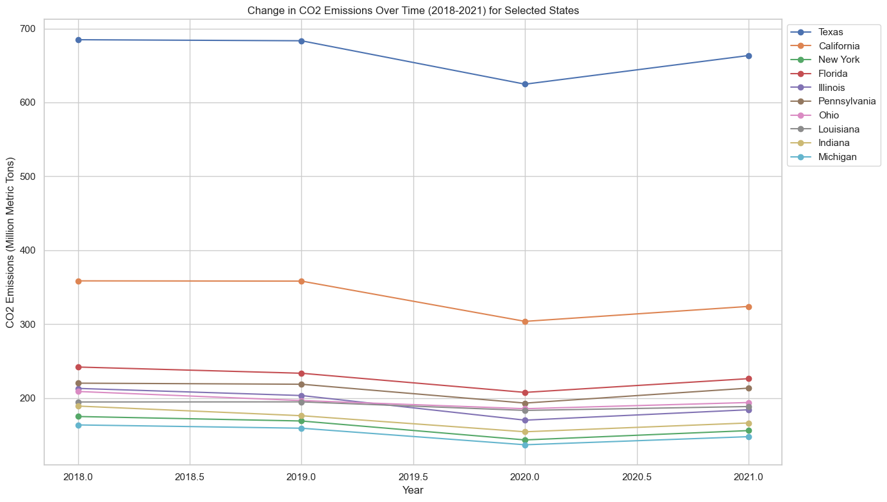
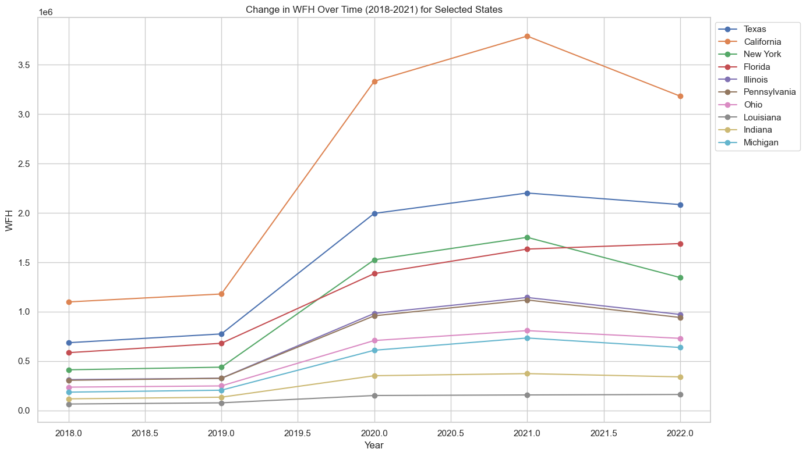
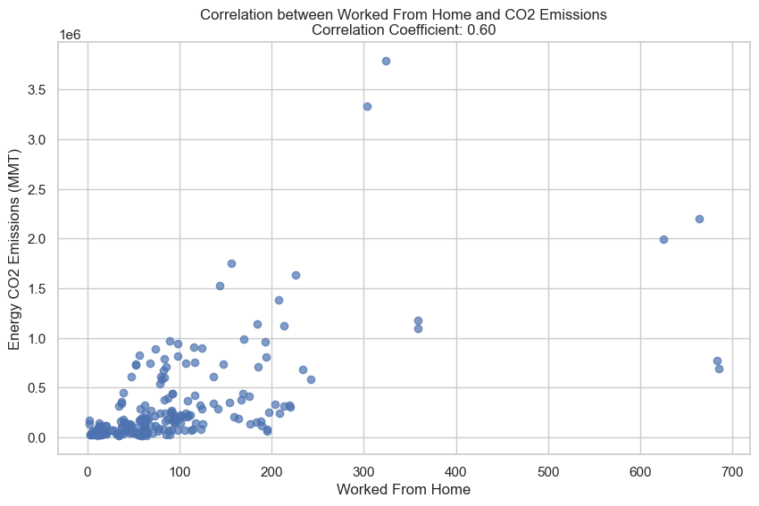
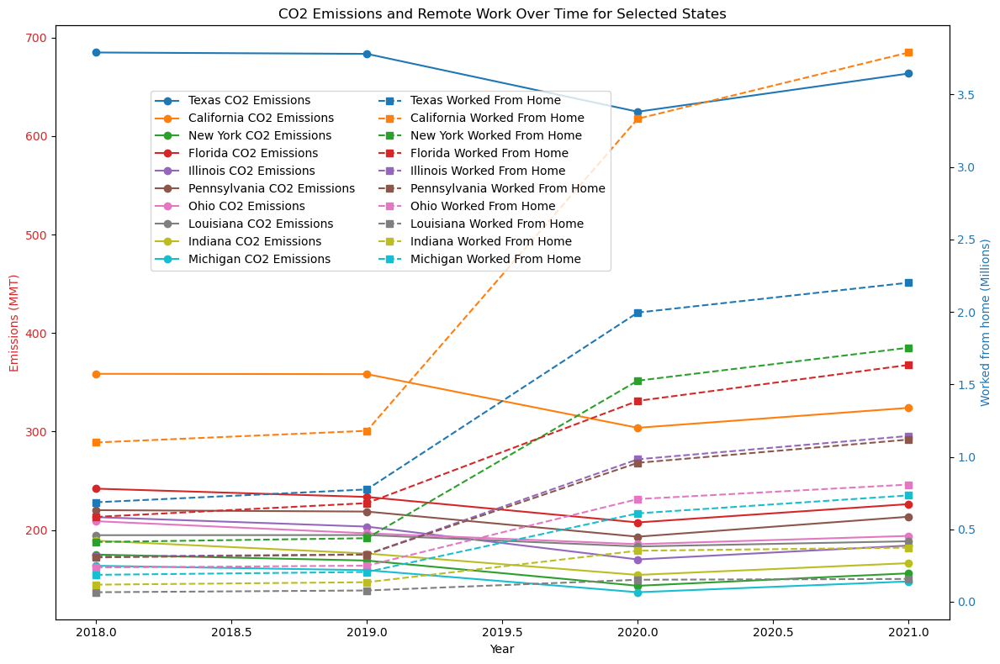
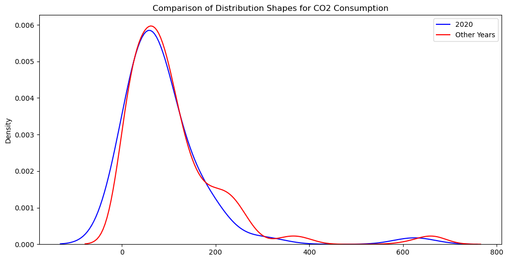
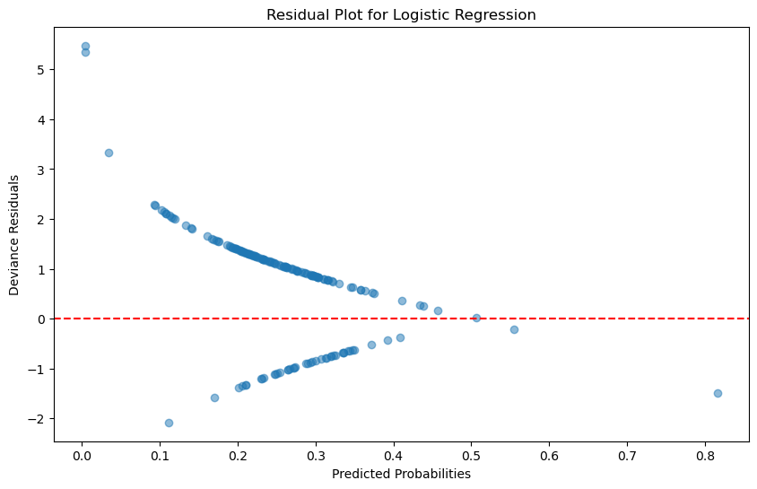
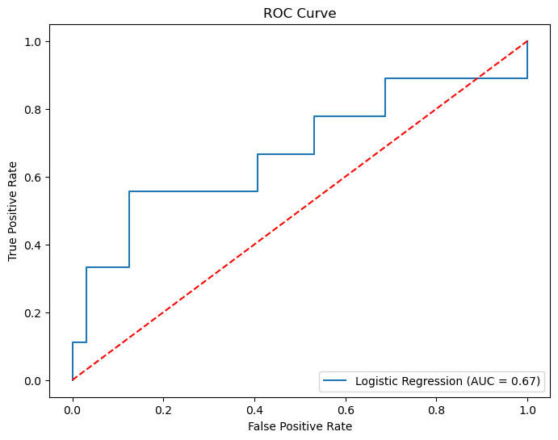
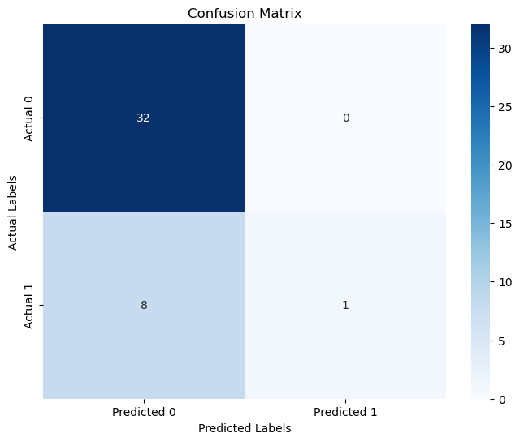

---

# Remote-CO2-Emissions189

---

Jun-Hee Hwang,

Isaiah Jones,

Nathan Ko

---

## Abstract

This study explores the relationship between the brief transition to remote work in 2020 and $\mathrm{CO_2}$ consumptions within the U.S. with the goal of understanding the environmental impacts of this shift. Utilizing a dataset from the U.S. Energy Information Administration, we embark on a comprehensive analysis using a variety of statistical methods including linear regression and hypothesis testing, to uncover significant trends and correlations. Through linear regression, we aim to explore the probabilistic and statistical relationship between the increase in remote work and changes in CO2 emissions. This research evaluates the environmental impact of increased remote work by comparing carbon footprints before, during, and after the pandemic, focusing on how shifts in remote work affect carbon emissions, urban planning, and infrastructure development. It provides valuable insights for governments, companies, and communities to adopt policies and projects that support sustainable practices.

## 1. Introduction

The COVID-19 pandemic changed work patterns across the world, shifting the work trend into remote. This raised questions about its potential impacts on the world, including environmental sustainability. By evaluating the environmental impact of increased remote work by comparing carbon footprints before the pandemic, during the pandemic, and after the pandemic. Comparing carbon footprints to evaluate the environmental impact before, during, and after the pandemic is important for many reasons. Understanding how remote work affects carbon emissions can help governments make rules, helping meet goals to reduce pollution. Insights from this analysis can help many companies that are committed to sustainability goals to understand how shifting work patterns may contribute to the goals. This research can also give an intricate analysis of the environmental change due to increased remote works, in which urban planners and infrastructure developers can adjust their projects to accommodate a future with potentially less commuting, which may reshape public transportation schedules, reducing road expansions, or repurposing office space areas into residential or green spaces. Moreover, communities can better prepare for any future disruptions, whether they’re due to health issues, environmental concerns, or technology changes. In this study, we will analyze the trends in CO2 emissions across different states over time, evaluate the relationship between the number of people working from home and CO2 emissions, identify any significant changes in CO2 emissions corresponding to the periods before, during, and after the peak of remote work adoption, and provide recommendations for policymakers, businesses, and urban planners on leveraging remote work as a strategy for reducing carbon footprints. Through various statistical analyses, including linear regression and residual analysis, this study offers a detailed understanding of the environmental implications of remote.​

## 2. Demographic and Behavioral Data
	
### 2.1 Data Source
Our data comes from the U.S. Energy Information Administration comprises CO2 emissions data for all fifty states from 1970 to 2021 and U.S. Census Bureau's American Community Survey comprises means of transportation data for all fifty states from 2018 to 2021.

The work from home data used in this project is from the U.S. Census Bureau's American Community Survey (ACS) 1-Year Estimates Detailed Tables. This dataset provides detailed information on the number of people working from home across different states in the United States. The data covers the years from 2018 to 2022, allowing for a comprehensive analysis of trends over time. The dataset can be accessed through the Census Bureau's advanced data tool [here](https://data.census.gov/table/ACSDT1Y2021.B08522?q=poverty&y=2021&d=ACS%201-Year%20Estimates%20Detailed%20Tables).

To ensure the accuracy and usability of the Work from Home data collected, we performed a comprehensive data cleaning process. Here is an outline of the steps taken to clean and prepare the data for analysis. We added a list of states, including the District of Columbia and Puerto Rico. However, Puerto Rico was excluded later due to its unique status. Then we imported the dataset for the years 2018 to 2021 using pandas. For each dataset, we filtered it such that it only included the rows indicating the number of people who “Worked at home.” So, the number of people working from home were extracted for each state. We created a separate DataFrames for each year with columns for ‘State’ and ‘Worked at home.’ Finally, we converted the column ‘Worked from home’ to an integer type and excluded Puerto Rico from the final dataset because the other datasets we were working with excluded them. 

The CO2 emissions data used in this project is from the U.S. Energy Information Administration (EIA). The EIA provides detailed information on energy production, consumption, and emissions. For this study, the state-wise CO2 emissions data was utilized to analyze the environmental impact. The data covers the years from 2000 to 2021, allowing for a comprehensive analysis of emissions over time. This data is available on the EIA’s official website [here](https://data.census.gov/table/ACSDT1Y2021.B08522?q=poverty&y=2021&d=ACS%201-Year%20Estimates%20Detailed%20Tables).

The CO2 emissions data used in this project is from the U.S. Energy Information Administration (EIA). The EIA provides detailed information on energy production, consumption, and emissions. For this study, the state-wise CO2 emissions data was utilized to analyze the environmental impact. The data covers the years from 2000 to 2021, allowing for a comprehensive analysis of emissions over time. This data is available on the EIA’s official website [here](https://data.census.gov/table/ACSDT1Y2021.B08522?q=poverty&y=2021&d=ACS%201-Year%20Estimates%20Detailed%20Tables).

To ensure the accuracy and usability of the CO2 emissions data collected, we performed a comprehensive data cleaning process. Here is an outline of the steps taken to clean and prepare the data for analysis. We imported the dataset from an excel file using pandas. Then the dataset was read with a `skiprows` parameter to remove the unnecessary rows from the top and we renamed the columns for clarity.  Since Work from Home data was from 2018 to 2021 then for CO2 emissions data we only used the columns for the state and the years 2018 to 2021. Then we reshaped the data by using the `melt` function to convert the wide format into a long format. We dropped irrelevant rows by identifying them by specific keywords in the ‘State’ column. Finally, the data was sorted by state and year, then any remaining rows with missing values were dropped and the ‘Year’ columns were converted to an integer type. 

To perform a comprehensive analysis of the environmental impact of remote work, the cleaned datasets for CO2 emissions and work-from-home data were merged into a single dataset. This allows for a unified view of the data, which will help with the comparison of remote work trends and carbon emissions across different states and years.

### 2.2 Exploratory Data Analysis

	Figure 1: Lineplot
	

This line plot displays the changes in CO2 emissions over time from 2018 to 2021 for selected states. The y-axis shows the CO2 emissions in million metric tons (MMT), and the x-axis represents the years.
Texas has the highest CO2 emissions, while other states show varying levels of emissions with some fluctuations over the years.
It is also possible to see that there is a sudden drop in CO2 Emissions from 2019 to 2020, which is the year when COVID-19 peaked.     

Figure 2: Lineplot

This line plot illustrates the change in the number of people working from home from 2018 to 2021 for selected states. The y-axis shows the number of people working from home, and the x-axis represents the years. Most of the states such as California shows a significant increase in the number of people working from home, especially around 2020, likely due to the COVID-19 pandemic.    

Figure 3: Correleation Scatter plot

	

This scatter plot shows the relationship between the number of people working from home and the CO2 emissions in million metric tons (MMT). Each point represents a state. The correlation coefficient is 0.60, indicating a moderate positive correlation between working from home and CO2 emissions.

Figure 4: Merged Line Plot

## 3  Statistical Analysis

### 3.1 Mann-Whiteny U Test
We wanted confirm our conclusion that there is a statistically significant difference between the CO2 consumption in the year 2020 and that of other years before including remote work data.
The Mann-Whitney U test is particularly advantageous for our dataset as it does not require the assumption of normally distributed data, thereby providing a robust alternative to the t-test when normality cannot be assumed. This nonparametric test is ideal because it evaluates the ranks of the data rather than their absolute values, making it well-suited for our analysis where the exact distribution of CO2 consumption is unknown or potentially skewed.  

**Question:** Was the average CO2 consumption in the year 2020 significantly lower than the average CO2 consumption in previous years?

**Null Hypothesis:**
$H_0$: The mean CO2 consumption in 2020 is equal to or greater than the mean $\mathrm{CO_2}$ consumption in other years.

**Alternative Hypothesis:**
$H_1$: The mean $\mathrm{CO_2}$ consumption in 2020 is lower than the mean $\mathrm{CO_2}$ consumption in other years.

**Significance Level:** 10%

#### 3.1.1 Assumptions
Before we perform any hypothetical test, we want to check what trends our data follows. We compared our two data groups' distributions if they were similar or different and we check if they were from a normal distribution.  

Before performing the Mann-Whitney U-test, we found that our data had these characteristics:
- Distributions between two groups must be similar. The KDE plot (Figure 5) shows that the year 2020 and other years do not have different distribution shapes. In addition, we performed a Kolmogorov-Smirnov test. With a KS statistic of 0.15 and a p-value of 0.16, we cannot reject the null hypthesis that they are statistically from different distributions. 

Figure 5: KDE Plot

- Not enough data points to justify the assumption of normality due to the Central Limit Theorem. As a result, we proceeded with the Mann-Whitney U-Test.

#### 3.1.2 Performance
After running `mannwhitneyu(data_2020, data_other_years, alternative='less')`, we recieved a p-value of 0.06, which is less than our significance level of 10%. This allows us to reject the null hypothesis to conclude that there was a statistically significant decrease in $\mathrm{CO_2}$ consumption in 2020 compared to other years.
	

### 3.2 Logistic regression
The logistic regression model can help determine whether there was a statistically significant association between the increase in remote work and a reduction or variation in CO2 emissions during 2020. This is particularly relevant given the global changes in work dynamics due to the COVID-19 pandemic. We decided to predict 2020 from given data.

#### 3.2.1 Initial Steps
We preprocessed our data so that we created a column `Is_2020` to represent our response variable, a binary categorical variable (2020 vs. other years). Moreover, logistic regression does not assume a linear relationship between the independent variables and the response variable but rather a linear relationship between the log-odds of the response and the predictors, making it apt for our categorical outcome.

#### 3.2.2 Performance

#### Checking for Linearity

Figure 6: Residual Plot for Logistic Regression

Logistic regression is different in that to we must look to the residual plots to make observations about the model's goodness-of-fit and other characteristics. We plotted the deviance residuals against the predicted probabilities in order to check for linearity. There is a noticeable trend where residuals decrease as the predicted probabilities increase. This non-random pattern, particularly the curved nature, suggests that the logistic regression model might not be capturing all the underlying complexities or non-linear relationships in the data. Ideally, 
The residuals should be scattered randomly around the red horizontal line without any discernible pattern for the model to be considered well-fitted.
Overall, while the current model provides some insights, the residual plot (Figure 6) suggests that improvements can be made either by adjusting the current model or considering alternative modeling approaches. 

### Model Evaluation
We achieved a 80.5% accuracy on our model which is relatively high considering we are only using two variables (work-from-home statistics and CO2 emissions) to predict whether a year was 2020 or not.  We achieved an Area under the ROC Curve (AUC) of 0.6736 which suggests that the model has a moderate ability to distinguish between the classes (2020 and not 2020). Specifically, there is a 67.36% chance that the model will rank a randomly chosen positive instance (actual 2020) more highly than a randomly chosen negative instance (not 2020).

Figure 7: ROC Curve Plot

The curve is above the diagonal line (which represents a random classifier), indicating that the logistic regression model performs better than a random guess. The initial steepness of the ROC curve is a good sign. It means that the model achieves a high true positive rate while maintaining a low false positive rate at lower threshold settings. However, there are segments where the curve flattens or progresses incrementally, suggesting that increasing the true positive rate beyond certain points requires accepting significantly higher false positive rates.

Figure 8: Confusion Matrix

The recall is quite low, indicating the model fails to identify the positive class (2020) effectively. This suggests that while the model is conservative about predicting the positive class, it misses many actual positives.
The model has perfect specificity, meaning it identifies all non-2020 cases correctly.
The F1 score is quite low, which indicates a poor balance between precision and recall, largely driven by the low recall rate.

	
## 4.  Conclusion and Future Works
	

References

[1] U.S. Energy Information Administration. (2023). State energy-related carbon dioxide emissions by year. EIA. 
		https://www.eia.gov/environment/emissions/state/
      
[2] (2024). . United States Census Bureau.
      https://data.census.gov/
      